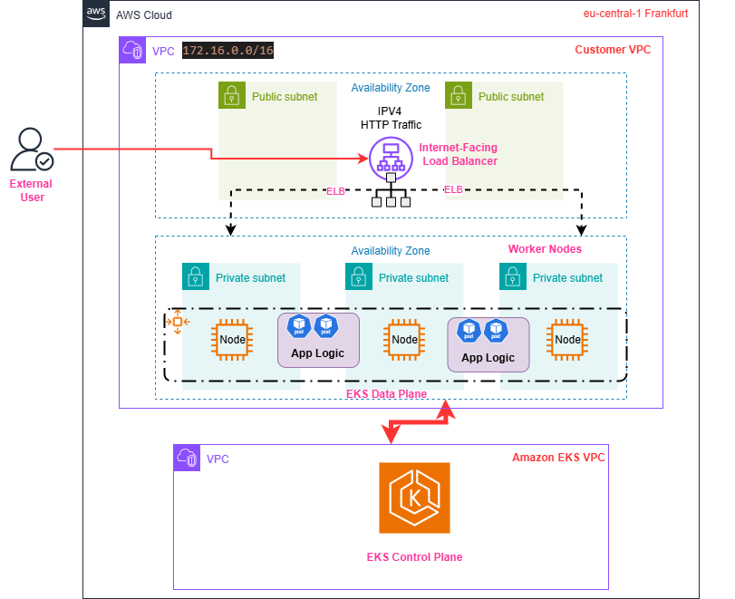

[](https://app.pulumi.com/new?template=https://github.com/pulumi/examples/blob/master/aws-py-appsync/README.md#gh-light-mode-only)
[](https://app.pulumi.com/new?template=https://github.com/pulumi/examples/blob/master/aws-py-appsync/README.md#gh-dark-mode-only)

<h1 align="Center"> OP2-PLAPP </h1>

**Author** : [Vasudeva Nayak Kukkundoor](https://www.linkedin.com/in/vazudew/)

This project OP2-PLAPP (_Option2 - PuLumi Application_) deploys a sample container web application containing a configurable value passed via environment variables.
Container orchestrator is EKS. Resources are deployed using [Pulumi](https://www.pulumi.com/) IaC onto AWS Cloud.


## Table of Content
* [Requirements](#reqs)
* [Considerations](#cons)
* [Architecuture](#arch)
* [Tasks](#task)
    + [Preparing Container Image](#image)
    + [Setup K8S Cluster](#k8s) 
    + [Scripts File Structure](#script) 
    + [Execution](#exec)
* [Results](#res)
* [Future Scope for Extensions](#future)
* [Pulumi Evaluation](#eval)
* [Useful Links](#useful)

## <a name="reqs"></a> Requirements

For the exercise following requirements are explicitly defined

- create a Dockerfile to create a custom image, which publishes simple webpage 
- set up a Kubernetes Cluster to manage containers
- prepare necessary k8s objects to host the webpage 
- configurable parameter, that will be part of published webpage, upon configuration set
- create ComponentResources to encapsulate resources for reusability, implement Best practices etc.

**Success Criteria**

In order to declare the project to be success, follwing points are acceptance criteria:
- Should be able to load the web page in a browser
- Should be able to change the configured value, run `pulumi up`, reload the web page and see the value change 2


## <a name="cons"></a> Considerations

Following topics are considered during solution building. 

- selected Python Language on AWS Cloud Platform in _eu-central-1_ (Frankfurt Germany) region
- used httpd image, which can support simple webpages with (command output) and (environment) based text patterns
  nginx image need additional configurations
- provisioned simple k8s objects such as _deployment_, and _service_. 
  Also *network_policy*, or _namespace_ or *config_map* could have been considered. 
  But they would lead to additional maintenance and efforts
- AWS Services used are, _VPC_ (networking), _EKS_ (container orchestrator), _IAM_ (Authorization) _ELB_ (Loadbalancer for external HTTP traffic), and _ECR_ (Container Images Repository)
- used _default_ VPC for the network infrastructure to reduce time for _PoC_ preparation
- provisioned simple and basic test automation for the resources, webpage, and container images 
- _Makefile_ with handy repeatitive commands to run 
  
## <a name="arch"></a> Architecture

Here is the standard architecture of EKS on AWS.

* __VPC__ hosting _public_ and _private_ Subnets. All internet facing entity such as _ELB_ will be hosted in _public_ subnet. _private_ subnet hosts secured items such as _EKS_ nodes, _pods_ or any Database objects

* We use _managed_ __EKS__ service, where in __AWS__ provisions its own VPC with __EKS__ _Control Plane_ for operating, scheduling, maintaining, fixing all _K8S_ objects

* All _k8s_ objects which constitutes application logic , in this case (Pods, Services) are hosted in _private_ VPC subnet.

* _User_ can access _ELB_ DNS Hostname as browsable link to naviagate to the application. Currently the encryption at transit is not enabled, hence web traffic is HTTP.

 <br />

Source : [AWS Architecture Reference](https://docs.aws.amazon.com/eks/latest/best-practices/subnets.html)


## <a name="task"></a> Tasks

### <a name="image"></a> Preparing Container Image <br />
- used httpd:2.4 image which provisions Apache webserver
- created a script, to collect _hostname_, _date_, and _environment_ variable and publish to an index.html
- the script would run first when container is built, provisioning required application start page
- prepared a _Dockerfile_ for container blueprint
- _Pulumi_ script to build an image from _Dockerfile_ and to push to _ECR_ Repo 

### <a name="k8s"></a> Setup K8S Cluster <br />
- _EKS_ Cluster on _default_ VPC with optimal nodes size
- provision _deployment_ k8s object with container image, expose the _deployment_ with _service_ of type _LoadBalancer_, which provisions _ELB_ Loadbalancer
- use _DNS_ name of _ELB_ connect with web application

### <a name="script"></a> Script File Structure <br />
- Folder __app__ hosts web application files such as _Dockerfile_ and *create_html.sh* to prepare start page with _hostname_, _environment_ variable and _time_
- __main.py__ contains main program for container app image management (__image_manager.py__), deployment on _EKS_ cluster (__k8s_manager.py__) and exporting _Pulumi_ outputs
- *Pulumi**._yaml_ holds all configuration files for _Pulumi_ operations
- _requirements.txt_ contains all the necessary _Python_ and _Pulumi_ modules for operations
- **app_tester.py** contains basic system testing test cases (checks success criteria)
- File _test_params.json_ contains testable parameters required for **app_tester.py**
- _Makefile_ contains shortened commands for running repititive commands 
- standard _GIT_ configuration files 
- Folder __resources__ may contain additional files for project such as images, documentations etc.

### <a name="exec"></a> Execution <br />

- This Project is solely developed with Python (_Python 3.10.12_) and it is required to have the Python, pip runtimes installed on your machine.
- _Pulumi_ version used here is v3.173.0

1. download the latest project code repo onto your machine
    ```bash
    $ git clone <URL_OF_THIS_REPO>
    ```
2. create a python Environment for executing scripts and install all the dependencies 
    ```bash
    $ python3 -m venv venv
    $ source venv/bin/activate
    (venv) $ pip install -r requirements.txt
    ```
3. supply _AWS_ credentials with Environment variables for the _Pulumi_ to deploy resources on _AWS_ Cloud.
   The credentials allow programmatic access and to create them, refer [HERE](https://docs.aws.amazon.com/workspaces-web/latest/adminguide/getting-started-iam-user-access-keys.html)
    ```bash
    (venv) $ export AWS_ACCESS_KEY_ID=A***************
    (venv) $ export AWS_SECRET_ACCESS_KEY=2V****************************************
    (venv) $ aws sts get-caller-identity  # ensure right identity is used
    ```

4. set a configurable value for the project, that will be passed onto container via Environment variable
    ```bash
    (venv) $ pulumi config set config_val pulumi_rocks!
    (venv) $ pulumi config #check the configured key and value
    KEY          VALUE
    ...
    config_val   pulumi_rocks! # the configured value is assigned
    ...
    ```
5. run `pulumi up` to preview and deploy changes:
    ```bash
    (venv) $ pulumi up
    Previewing update (dev):
    ...

    Updating (dev):
    ...
    Resources:
        + XX created
    Duration: 27m 16s
    ```
6. Fetch the _op2_plapp_url_ output exported from the script. Open a Browser and navigate to this _URL_. Please ignore the security warning issued by the Browser for the link, as it only accepts unsecure HTTP traffic.

7. you can test the success criteria, by executing sample Test Script. 

   ```bash
    $ python app_tester.py 
    CONFIGURED_VALUE: pulumi_rocks!
    URL: aecd42b0018984706be3ec6a0e6abc3b-1952968369.eu-central-1.elb.amazonaws.com
    configured value is displayed, PASS!
    TEXT:
    Hello World 

            Hostname: <font color='red'> op2-plapp-deployment-6b1cfb98-cbdcd9cf-67lhh </font> 
              Configured Value: <font color='blue'> pulumi_rocks! </font> 2025-06-05 09:58:46 
    
    URL: aecd42b0018984706be3ec6a0e6abc3b-1952968369.eu-central-1.elb.amazonaws.com
    website reacahble, PASS!
    .
    ----------------------------------------------------------------------
    Ran 2 tests in 0.127s

    OK
    ```

8. cleaning up
   ```bash
    (venv) $ pulumi destroy  # tears down entire resource stack
    (venv) $  pulumi stack rm # Note: deletes all deployment history from the Pulumi console
    (venv) $  deactivate #python environment gets deactivated
    ```

## <a name="res"></a> Results
1. The Browser displays the web page, and hence the application is _up and running_!
2. You can also open other Browser instance for the same link, and see the web page is load balanced between container instances. Differentiator is _Hostname_ displayed on Web page.
3. Also one can see that configured value is displayed on the web page.

 <br />
* website is up and active (via loadbalancer DNS)
* loadbalancing of traffic between instances (hostname)
* configured value is displayed 

## <a name="future"></a> Future Scope for Extensions

This Project can be extended further with following features :
* cicd pipeline to deploy [AWS Cloud natively](https://aws.amazon.com/de/codepipeline/)
* container image scanning with tools such as [trivy](https://trivy.dev/latest/)
* secure Loadbalancer Endpoints with HTTPs using [ACM Public Certificates](https://docs.aws.amazon.com/acm/latest/userguide/acm-overview.html)
* use [cost estimation](https://github.com/lyft/awspricing) scripts for deployed resources 
* [Helm charts](https://helm.sh/) and [argoCD](https://argo-cd.readthedocs.io/en/stable/) for K8s related deployments and cool dashboard
* implementation of Logging and Monitoring solutions, depending on application


## <a name="eval"></a>  Pulumi Evaluation

| Sl. No | Feature        | Remarks                  | Evaluation              |
| ------------- | ------------- | ----------------------- | ----------------------- |
1| Ease of use   | 1. CSP-LANG-SERVICE styled templates, with boiler plate code  <br> 2. Terraform like Operations <br> 3. Dashboard with Pulumi Cloud| USP of Pulumi :bowtie: |
2| Intelligence | 1. Support for troubleshooting with [Pulumi Co-Piolt](https://www.pulumi.com/product/copilot/) <br> 2. Language and Usecase specific Code generation with [Pulumi AI](https://www.pulumi.com/ai) | USP of Pulumi `:bowtie:` |
3| Documentation | 1.Multi language specific modules and examples <br> 2. CSP and Service specific providers and support  | USP of Pulumi `:bowtie:`  |
4| Examples | 1. CSP-LANG-SERVICE specific examples exist [Here](https://github.com/pulumi/examples/tree/master) <br> 2. Public Repository of modules and examples | a. Example organization could have been better `:neutral_face:` <br> b. Not many use cases for all languages are present  `:neutral_face:`|
5| Latency | It may take time to load CSP-LANG-SERVICE styled templates and initializing <br>  | It may need performance optimization `:innocent:`|

## <a name="useful"></a> Useful Links

For the project, following digital materials are very resourceful and gives you better orientation with Pulumi.

| **Sl. No.** | **Link** | **Remarks** |
----------|--------------|--------------
1| [PulumiTV](https://www.youtube.com/@PulumiTV/playlists)| Pulumi Youtube Video Official Playlist|
2 |[Official Docs](https://www.pulumi.com/docs/iac/)| Pulumi official documentation accross Languages/Providers|
3|[A Sample Workshop](https://www.youtube.com/watch?v=9pX2cr9o6_k&t=5899s) | Workshop by Anmaol Sachdeva, highlighting the operations |
4|[Pulumi-AWS](https://www.pulumi.com/registry/packages/aws/api-docs/), [Pulumi-Docker](https://www.pulumi.com/registry/packages/docker/api-docs/), [Pulumi-K8s](https://www.pulumi.com/registry/packages/kubernetes/)| Pulumi technology specific references |
5|[Pulumi-Python](https://www.pulumi.com/docs/iac/languages-sdks/python/)| All Pulumi Python documentation|
6 |[Pulumi-Examples-Github](https://github.com/pulumi/examples)| Various use cases and examples for Pulumi automation|
7 |[Pulumi Container Registry](https://github.com/pulumi/pulumi-docker/tree/master/examples/aws-container-registry/py)| Code reference to work with Pulumi Container images|
8 |[Pulumi Configurations ](https://github.com/pulumi/examples/tree/master/aws-apigateway-py-routes)| Code reference to work with Pulumi Configuration variables |
9 |[Component Resource Example](https://github.com/pulumi/examples/blob/master/classic-azure-py-webserver-component/webserver.py)| Definition and working example for Pulumi [ComponentResources](https://www.pulumi.com/docs/iac/concepts/resources/components/)|
10 |[Pulumi with EKS](https://www.pulumi.com/blog/easily-create-and-manage-aws-eks-kubernetes-clusters-with-pulumi/)| Sample K8s provider on EKS example|